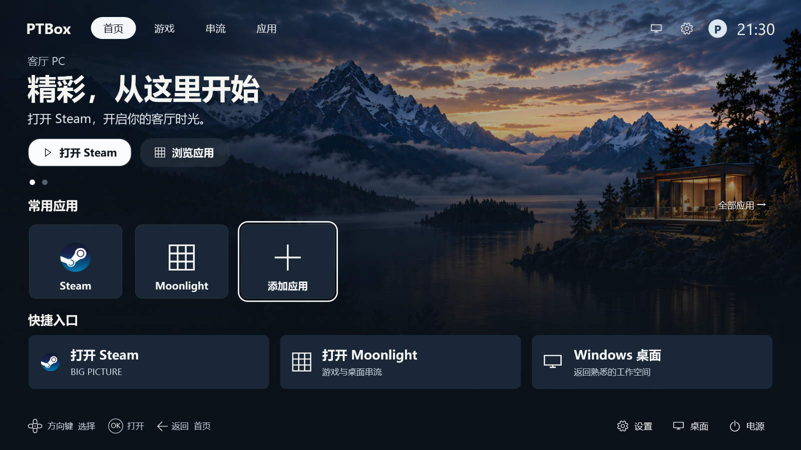

# PTBox · Windows 客厅首页

面向 Windows 11 电视、飞鼠和键鼠的轻量启动器。使用 C# / .NET 8 / WPF，支持 x64，无第三方 NuGet 依赖、服务器或数据库。游戏库由 Steam / Playnite 管理，PTBox 负责应用入口、导航与返回首页。

**当前版本：1.1.3** · [下载最新版](https://github.com/NeuronXL/PTBox/releases/latest) · [版本记录](CHANGELOG.md)



## 下载与安装

在 [GitHub Releases](https://github.com/NeuronXL/PTBox/releases) 下载：

- `PTBox-Setup-1.1.3-win-x64.exe`：安装包，包含运行环境，无需安装 .NET。默认安装到 `%LOCALAPPDATA%\Programs\PTBox`，无需管理员权限。
- `PTBox-1.1.3-win-x64-portable.zip`：解压完整目录，双击 `PTBox.Launcher.exe`。
- 对应的 `.sha256` 文件：用于核对下载文件。

首次启动全屏显示空应用列表，选择“添加应用”开始配置。Steam 和 Moonlight 是可选模板，不会自动安装或添加。默认不开启登录自动启动。

选择“添加应用 → 本地程序 / 桌面快捷方式”，可从“桌面”或“公共桌面”选择 `.lnk`，也可选择网页或游戏的 `.url`。LNK 保留原快捷方式路径，由 Windows 按原参数和工作目录打开，因此添加后请保留该快捷方式；默认直接打开，不等待退出或强制复用进程。

安装版数据保存在 `%LOCALAPPDATA%\PTBox`，首次启动会备份并迁移旧安装目录的配置；发生冲突时提供选择。便携版优先使用程序目录，无法写入时回退到个人目录。卸载保留个人数据。

1.0.0 / 1.0.1 用户需要手动安装一次接入版，之后可在“设置 → 关于与更新”检查、下载并安装新版本。安装包目前没有 Windows Authenticode 代码签名；应用内更新使用 RSA-PSS 签名清单和 SHA256 校验。

## 功能

- 大屏首页、动态分类、应用推荐、快捷入口、实时时钟和空列表引导。
- 添加、删除、改名、排序及分类管理；支持 EXE、HTTP(S) 网页和应用 URI。
- 优先显示自定义图标，否则读取程序、协议或网站原图标；失败时显示通用图标。
- EXE 按完整路径复用现有进程；可等待进程退出后自动返回首页。
- 单实例、全局返回热键、Windows 桌面入口、全屏与窗口模式。
- 深色设置与文件选择器、自定义背景、两种主题、可选登录自动启动。
- 配置校验、损坏备份、未来格式保护及本地滚动日志。
- GitHub Releases 更新检查、签名下载、取消重试和独立更新器。

首页使用 1600×900 逻辑画布等比缩放，支持 PerMonitorV2 DPI。保留正常 Windows 桌面及系统快捷键，不替换 Windows Shell。

## 操作

| 输入 | 行为 |
| --- | --- |
| 方向键 | 在分类、推荐、应用、快捷入口和底栏之间导航 |
| Enter / Space / 遥控器 OK | 打开选中项 |
| Esc / Backspace / BrowserBack | 子页返回；首页不退出 |
| 鼠标左键 | 选中并打开；悬停不抢键盘焦点 |
| Ctrl+Alt+H | 从其他应用返回首页 |
| 再次运行 PTBox | 唤回同一实例 |
| F11 | 临时切换全屏 / 窗口 |
| 桌面入口 | 最小化首页 |
| Alt+F4 / 退出 Launcher | 关闭首页 |

电源菜单中的关机、重启均须再次确认，默认选中取消，不强制结束外部应用。文本框中左右键和 Backspace 编辑文字；单行文本框上下键离开字段。

## 开发

需要 Windows 11 x64 和 .NET 8 SDK。可用 Visual Studio 的“.NET 桌面开发”工作负载打开 `PTBox.sln`，也可以从根目录运行 PowerShell：

```powershell
# 没有 SDK 时，下载到项目内并验证微软提供的 SHA512
.\scripts\setup-sdk.ps1

.\scripts\build.ps1       # 构建整个解决方案
.\scripts\run.ps1         # 开发运行
.\scripts\test.ps1        # 业务、网络模拟、进程及 WPF 集成测试
.\scripts\publish.ps1     # 自包含便携版
.\scripts\package.ps1     # 自包含安装包
```

测试前退出已有 PTBox，测试会短暂显示 WPF 窗口。脚本优先使用项目内 SDK；打包时会下载并校验 Inno Setup。`publish.ps1` 保留已有便携目录中的配置，安装包则始终使用新的干净目录。

`scripts/release.ps1 -Version x.y.z` 完成测试、打包、签名和本地自验，**不会自动上传**。维护者需要与客户端内置公钥匹配的私钥；普通源码构建不需要私钥。不要重新生成信任根来替代丢失的发布密钥。

## 工程结构

| 路径 | 职责 |
| --- | --- |
| `src/PTBox.Launcher` | 首页、设置、导航、启动、图标、配置和系统操作 |
| `src/PTBox.UpdateCore` | 更新协议、GitHub 下载、签名校验和任务身份检查 |
| `src/PTBox.Updater` | 独立安装过程与新版启动确认 |
| `tools/PTBox.ReleaseTool` | 发行签名、本地密钥管理与发行物验证 |
| `tests` | 功能测试、WPF 集成及外部进程测试程序 |
| `scripts` / `installer` | 开发、打包与安装验收 |
| `docs` | 配置、设计、发布操作与验证记录 |

## 验证与限制

快捷方式功能已完成 Release 构建及 27 组测试，包括真实快捷方式启动和 WPF 添加流程。界面图片来自 WPF 渲染，不能替代实体电视、遥控器、混合 DPI 和 HDMI 热插拔验收。

- 尚未接入 XInput，遥控器需映射成标准键盘或鼠标输入。
- 自动返回跟踪进程退出；常驻应用、浏览器及转交子进程的启动器建议使用 `fireAndForget`。
- 首版更新不支持差分、断点续传或完整自动回滚，安装失败提供日志与手动修复说明。
- 真实跨版本安装升级及失败恢复仍需干净 Windows 环境验收。

详见[配置说明](docs/configuration.md)、[发布操作](docs/release-operations.md)、[验证记录](docs/verification.md)和[路线图](ROADMAP.md)。早期设计及验证文档保留历史记录，当前实现以源码和对应版本记录为准。
