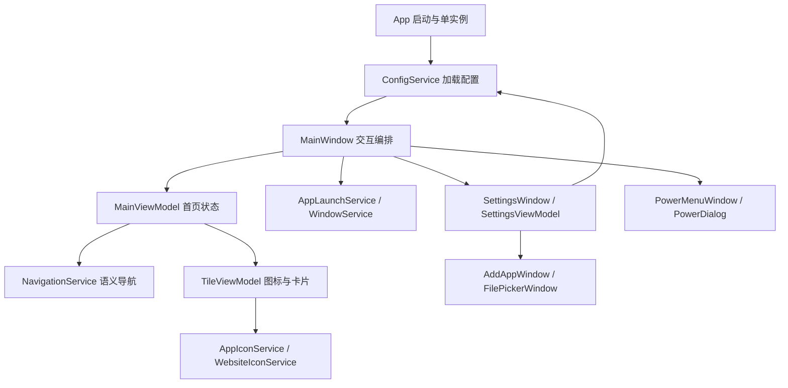

# 工程设计

> 本文保留 1.0.0 架构基线。1.1.1 的 UpdateCore、Updater、UpdateService 及数据迁移设计见 [发布操作](release-operations.md)，下文更新相关“后续”条目不代表当前尚未实现。

基线：2026-09-22 / 安装包 1.0.0。本文描述已实现代码；计划中的在线更新架构见 [GitHub Releases 更新方案](release-update-plan.md)。文档导航见 [文档首页](README.md)。

## 模块与依赖

| 源码位置 | 主要职责 |
| --- | --- |
| `App.xaml`、`App.xaml.cs` | 应用资源、窗口字体与图标、启动、单实例监听、异常日志 |
| `Models/LauncherConfig.cs`、`LauncherItem.cs` | JSON 数据模型与配置深拷贝 |
| `Views/MainWindow.xaml.cs` | 输入映射、激活入口、模态窗口、热键、全屏和进程退出返回 |
| `ViewModels/MainViewModel.cs` | 分类、推荐、应用、快捷入口与导航目标重建 |
| `ViewModels/TileViewModel.cs` | 卡片文本、选择状态、异步图标与资源回退 |
| `Services/NavigationService.cs` | 不依赖 WPF Key 的二维方向导航 |
| `Views/SettingsWindow*`、`ViewModels/SettingsViewModel.cs` | 设置草稿、编辑与保存，系统设置变更 |
| `Services/AppTemplateService.cs`、`Views/AddAppWindow*` | Steam/Moonlight 模板发现、去重和添加类型选择 |
| `Views/FilePickerWindow*`、`ViewModels/FilePickerViewModel.cs` | 深色文件选择、目录异步读取、筛选和路径验证 |
| `Services/AppLaunchService.cs`、`PathService.cs` | 路径解析、协议校验、进程复用与启动 |
| `Services/WindowService.cs` | Win32 窗口恢复、前台切换、主屏全屏与热键调用 |
| `Services/SingleInstanceService.cs` | 用户 SID 隔离的命名互斥量和激活事件 |
| `Services/ConfigService.cs`、`LoggingService.cs` | 配置校验/恢复/写入、日志轮换 |
| `Services/AutoStartService.cs`、`SystemPowerService.cs` | 当前用户自动启动及正常关机/重启 |
| `Services/AppIconService.cs`、`WebsiteIconService.cs` | 本地图标提取、协议关联、网站图标和磁盘缓存 |
| `Services/ArtworkService.cs` | 嵌入式背景素材和类别识别 |

当前是轻量 MVVM：展示状态在 ViewModel，窗口事件和系统调用编排保留在 code-behind；没有引入 DI 容器、路由框架或命令库。所有表内源码均相对于 `src/PTBox.Launcher/`。

## 边界

这是整台客厅 Windows PC 的首页，不维护游戏库，不扫描游戏资产，不提供网络服务。仅 .NET / WPF 和少量 Win32 P/Invoke。系统入口固定保留桌面、设置、退出和电源。

## 视图与导航

首页用 Grid、横排 ItemsControl、快捷入口 UniformGrid 和一个等比 Viewbox。1600×900 是逻辑设计画布而非固定显示分辨率，WPF 根据 DPI 把窗口像素换算为 DIP 后再次按当前可用空间缩放，因此相同长宽比下 4K 和 1080p 的卡片占屏比例相同。背景覆盖整个窗口；超过一屏的应用卡片在内部 ScrollViewer 中横向滚动。

选中状态只有一份：MainViewModel.SelectedIndex。键盘二维移动、鼠标点击、Tab 获得焦点都同步该状态。鼠标悬停仅改变边框，不抢选择。导航服务用明确的行列节点；左右限制同一行，上下先取最近行再取最近水平中心。顶部分类、推荐按钮、推荐分页、应用、快捷入口与底栏均有显式位置映射。分类高亮 IsActive 与当前键盘焦点 IsSelected 分开，避免当前分类与焦点混淆。

外部输入可以转换为 NavigationDirection 调用同一导航服务，以后接入 XInput 时无需改变布局或配置模型。

## 生命周期

1. 用户选择卡片并确认，保存最后选中 ID。
2. EXE 解析环境变量 / 完整路径 / App Paths / PATH；找不到时显示可进入设置的错误对话框。
3. 若允许复用，按 EXE 的完整路径寻找同名进程并尝试恢复窗口。避免重复启动 Playnite。
4. Launcher 保持后台普通窗口，从不永久置顶；启动进程仍可覆盖它。
5. waitForExit 使用异步等待；进程退出后恢复窗口及选中按钮的键盘焦点。新启动取消旧等待，不终止外部进程。
6. URI / URL 规范化为 fireAndForget，防止把协议处理器瞬时进程当作应用生命周期。
7. 桌面模式最小化；Ctrl+Alt+H 和按用户 SID 命名的单实例事件均可唤回。

Windows 的前台权限策略不能被通用 Launcher 完全保证；本实现不通过持续置顶或强制输入挂接绕过策略。

## 本地持久化

可写发布目录作为便携数据根；只读安装目录回退 LocalAppData/PTBox。JSON 校验版本、类型、数量和 ID，按临时文件 + Move 覆盖保存，避免写一半的内容成为有效配置。损坏文件先备份再恢复默认。日志大小轮换。

设置用配置深拷贝作为草稿。保存时先校验，再改变必要的 Run 项并保存 JSON；如果 JSON 保存失败，会尝试回滚本次 Run 变更。启动时只读取 Run 状态，不根据手写 JSON 自动修改注册表。

## 性能与安全后备

首页没有视频解码、持续网络轮询或复杂阴影。卡片只做 140ms ScaleTransform 动画，时钟每 15 秒刷新。默认背景和九宫格场景图集作为程序集资源读取一次并冻结，图集用于推荐背景；应用卡片使用纯深色底和应用原图标。用户图标和背景分别设置 512 / 2560 的解码宽度。

应用图标异步读取，自定义图片优先；本地 EXE 使用 `SHDefExtractIconW`，协议图标通过 `AssocQueryStringW` 关联查询。原生 HICON 用完释放，跨线程返回的 WPF 位图冻结。网站图标限制并发为 4，单次请求约 4 秒超时，图标上限 2 MB、HTML 上限 256 KB；磁盘缓存按源站散列命名，有效期 7 天，联网失败可退回过期缓存。加载失败显示通用图标，不阻塞首页。

应用运行 asInvoker，不替换 explorer，不拦截系统快捷键。关机与重启必须经默认取消的模态框确认，调用系统 shutdown.exe 且不使用 /f。异常写日志，配置缺损和资源缺失有回退。

## 界面资源和弹窗

`HomeStyles.xaml` 定义首页卡片和导航样式；`SettingsStyles.xaml` 定义按钮、输入框、下拉框、开关、列表项与滚动条，并由应用资源引用；`DialogStyles.xaml` 在此基础上提供共享弹窗外框、标题、说明和方向键提示。新增常规弹窗应复用这些资源。

`AddAppWindow` 创建应用草稿，`FilePickerWindow` 只返回选中的现有文件路径，`PowerMenuWindow` 返回动作枚举，`PowerDialog` 返回确认结果；实际执行由调用者负责。确认关机/重启默认聚焦取消。灾难性未处理 UI 异常仍保留系统 MessageBox 作为后备。

文件选择器通过后台任务读取单层目录，保留目录和允许类型的文件，先目录后名称排序。请求序号避免较早的异步结果覆盖新目录；关闭窗口后忽略仍在读取的结果。选择文件不会复制资源，也不会运行 EXE。

## 后续扩展的约束

1. 新输入设备转换为语义方向与确认/返回，避免建立另一份首页选择状态。
2. 新应用来源只能添加用户确认的配置项，不自动恢复已删除模板。
3. 配置保存必须保留草稿隔离、错误回退和原配置保护。
4. 下一阶段更新逻辑放到独立服务和独立更新进程；退出、安装与重启不能在 UI 线程阻塞等待。
5. 安装版数据根的调整必须先做迁移与兼容性设计，不能直接修改 `ChooseDataDirectory()` 后忽略旧配置。
