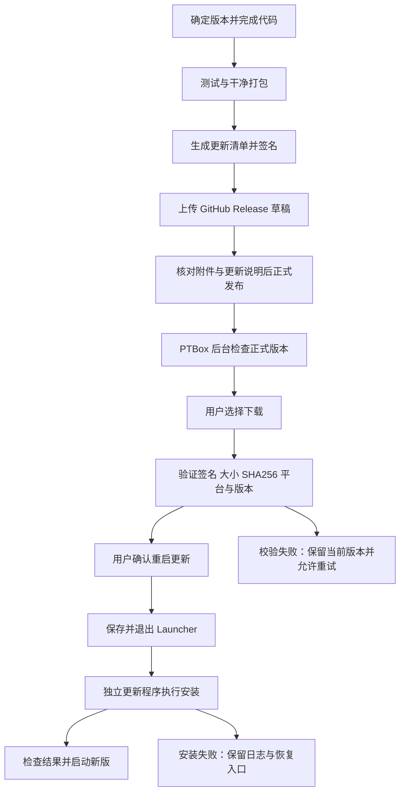

# GitHub Releases 发布式在线更新方案

> 历史设计：2026-09-22 已获准上传源码并发布 1.1.1，之前“不初始化 Git、不上传”的阶段性约束已结束。下文原始计划保留供参考，当前行为见 [发布操作](release-operations.md)。

状态：**本地功能已实现，未上传或发布，真实安装升级待验收**。更新日期：2026-09-22。仓库：`NeuronXL/PTBox`。当前实现和实际边界以 [发布更新操作](release-operations.md) 为准。下文保留最初方案；上传自动化尚未实施，严格遵守用户“不初始化 Git、不上传”的约束。

用户已选择 GitHub Releases 作为发布渠道。以下为 PTBox 首版在线更新的实现基线；具体仓库地址、可见性、发布身份和首个版本号仍待确定。进度由 [ROADMAP.md](../ROADMAP.md) 维护。

## 1. 目标与范围

实现“发布正式版本 → 应用内检查 → 下载并校验 → 用户确认 → 重启 Launcher 完成升级”。保持现有 Inno Setup 完整安装包，首版不实现运行中替换 WPF 代码、差分补丁、强制升级、多更新通道或完整自动回滚。

不重启 Windows，不中断游戏或串流；Launcher 的退出不应关闭任何由它启动的外部应用。安装只在用户确认后执行，不通过定时任务或 Windows 服务驻留。便携版第一阶段提供版本信息和手动安装引导，不默认执行安装版的静默覆盖流程。

当前已有：版本化安装包、SHA256 文件、升级保留配置、安装器测试。当前缺少：GitHub 更新源、客户端更新页、发布清单与签名、下载服务、独立更新进程、数据迁移和线上发布自动化。

## 2. 总体流程

## 3. 仓库与发布权限

建议使用公开发布仓库存放安装包和发布说明，客户端匿名读取，源码可放在另一个私有仓库。公开发布仓库中的二进制同样公开；这是待确认的部署选择，不代表本次已授权公开上传。若改成私有发布仓库，需重新设计每台客户端授权，不能把维护者 Token 嵌入 EXE。

源码初始化 Git 时排除 `.tools`、`artifacts`、构建输出、个人配置、日志和密钥。当前项目尚无 Git 元数据，也没有配置远程仓库。

首版优先提供本地发布脚本，复用现有 PowerShell 构建与安装测试。GitHub Actions 可在流程稳定后接入同一脚本；CI 发布凭据和签名私钥仅由发布环境持有，客户端只包含校验公钥和固定仓库标识。

## 4. 发布产物和协议

| 内容 | 约定 |
| --- | --- |
| Tag | `v<major>.<minor>.<patch>`，与程序和安装器版本一致 |
| 正式包 | `PTBox-Setup-<version>-win-x64.exe` |
| 更新清单 | `update.json`，UTF-8 无 BOM，固定字段格式 |
| 清单签名 | `update.json.sig`，对清单原始字节签名，不在客户端重新序列化后验签 |
| 人工校验文件 | 保留已有安装包 `.sha256`，方便人工下载核对 |
| 更新说明 | GitHub Release 正文；仅作为文本展示，不执行其中的 HTML、脚本或命令 |

清单拟包含：`schemaVersion`、`version`、`channel`（首版为 stable）、`rid`（win-x64）、`minWindowsBuild`、`minUpdaterVersion`、安装包 `assetName`、`downloadUrl`、`size`、`sha256`、`publishedAt` 和签名公钥标识 `keyId`。字段校验规则与测试向量在 M2.2 固定，不能用当前配置字段 `version: 1` 代替软件版本。

首版建议采用 .NET 自带 RSA-PSS / SHA-256 做清单签名，私钥不入库，公钥编入应用。未知 keyId、错误签名、未知清单格式直接拒绝执行。SHA256 只证明文件与清单一致，不能单独证明发布身份；清单签名与当前尚未购买/配置的 Windows Authenticode 代码签名是不同能力。

版本按三段数字解析比较，不能进行字符串比较。首版只更新到更高的 stable 版本；不兼容的最低更新器版本给出手动安装指引，避免无提示地跳过必要迁移。密钥轮换需要先由旧密钥可信的版本分发新公钥，再切换签名，不能让清单自己声明任意可信公钥。

## 5. 维护者发布流程

1. 从明确的源码版本生成三段版本号，填写更新说明；固定依赖与工具版本。
2. 运行应用测试，干净发布并打包，在隔离环境验证安装和配置保留。
3. 计算大小与 SHA256，生成清单，签名并用发行公钥自验。
4. 创建指定 Tag 的 Release 草稿，上传完整附件；上传失败保留草稿，不使客户端发现半成品。
5. 核对版本一致、附件齐全、无个人数据；将草稿正式发布为 stable 最新版本。
6. 用真实客户端验证从 GitHub 检查、下载和更新，保存发布记录与校验值。

拟新增 `scripts/release.ps1`（尚不存在），复用 `package.ps1`；上传和正式发布使用明确的脚本选项，默认生成/上传草稿。不得在常规构建时自动把本地项目上传到公共仓库。

已发布的版本内容保持不变；出现问题撤回推荐并发布更高版本号修复版。仅从服务端撤回 Release 无法召回已经下载的包，因此必须依靠正式发布前测试和显式用户确认降低影响，首版不声称具备实时撤销机制。

## 6. 客户端检查与交互

设置页增加“关于与更新”，沿用当前圆角深色样式、白色焦点和方向键操作。展示当前版本、最新版本、更新说明、下载大小、进度、失败原因及检查时间。

启动后延迟后台检查，自动检查最多每天一次；手动按钮可立即触发，但同一时刻只运行一次检查/下载。保留“自动检查”开关。后台失败不弹出抢焦点窗口，手动操作失败则显示重试入口；游戏和串流期间不自动最小化、退出或安装。

检查 GitHub 正式最新 Release，忽略草稿和 prerelease，并再次验证自身版本规则及清单。使用有限超时、失败退避和条件请求缓存；缓存结果不能跳过签名及安装前文件验证。GitHub 重定向下载必须保持 HTTPS，初始仓库/附件地址固定，重定向目标采用明确的 GitHub 下载主机规则。

状态定义：`Idle → Checking → UpToDate / Available → Downloading → Verifying → ReadyToInstall → Installing → Completed / Failed`。检查失败和下载失败回到可重试状态；“暂缓”保留有效下载；重复点击不创建第二个安装任务。

下载使用专属临时文件，限制响应大小并核对实际字节数；文件完整且 SHA256 正确后才标记就绪。取消、断网或错误包不影响当前程序。首版允许重新完整下载，不把断点续传列为必需功能。

## 7. 独立更新进程

拟新增 `src/PTBox.Updater/`（尚不存在），负责跨越 Launcher 退出后的安装生命周期。它必须运行在安装目录外的受控暂存位置，避免自己锁住将被替换的文件。

执行顺序：

1. Launcher 确认没有未处理的设置草稿；保存配置失败则停止升级，不静默丢弃。
2. 创建更新任务记录，包含目标版本、安装目录、包路径、发起进程身份和日志位置；不接受清单传来的任意安装命令。
3. 启动更新程序完成准备确认，再正常退出 Launcher；若用户取消或旧进程未正常结束，不强制结束外部应用。
4. 更新程序验证目标是本次 PTBox 安装，核对发起进程与路径，避免仅凭可复用 PID 操作进程；设置更新互斥锁，防止多次安装。
5. 安装前重新验证签名与包文件，避免下载后文件被改动；构造固定参数并正确引用路径，静默安装到原位置，带 `/NORESTART` 和独立日志。
6. 等待安装完成，区分成功、失败、取消以及需要系统重启的结果；即使系统报告需重启也不自动重启 Windows。
7. 成功后从固定安装路径启动新版，等候有限时间内的版本/就绪确认；记录完成状态，恢复有效的最后选择。
8. Launcher 无法启动或安装失败时，由更新程序显示恢复说明和日志路径，不能只把错误写到已经退出的主窗口。

更新程序须重新校验关键输入，不把临时任务 JSON 当成可执行指令来源。首版仅支持已识别的当前用户安装版；非受支持位置或权限不足时提示手动升级。

## 8. 数据隔离与接入迁移

当前程序优先写 EXE 同目录；目标是让安装版明确使用 `%LOCALAPPDATA%\PTBox`，便携版保持自己的数据目录。必须通过安装标记或明确模式识别区分二者，不能只按文件夹名称猜测安装形态。

迁移在 M2.1 实现：识别当前实际配置 → 备份 → 解析验证 → 复制到暂存位置 → 处理相对图标/背景路径 → 再验证 → 原子切换 → 记录完成标记。失败继续保留原目录可恢复，不先删除源数据；重复启动不能重复覆盖已迁移的新配置。

目标目录已有配置时不直接覆盖或自动合并，提供明确选择并分别保留备份。相对资源需要复制到新的受管资源目录并调整引用，或保持其可解析的旧绝对位置；绝对路径不擅自移动。卸载继续默认保留个人数据。

当前旧格式读取器遇到未知格式会恢复默认值，因此在引入新字段/版本前，要先增加“未来格式拒绝写回”保护和兼容性测试。数据迁移不能作为未测试的安装脚本附带动作。

现有 1.0.0 无法自动发现更新，需手动安装一次首个接入版。该接入版应完成数据迁移、可信公钥和更新服务部署；后续在线升级才从它开始验收。

## 9. 失败与恢复边界

| 场景 | 必须达到的结果 |
| --- | --- |
| 无网络、GitHub 限流、404 | 当前应用可用；手动检查有原因提示，后台检查退避 |
| 清单损坏、签名错误、未知 keyId | 不下载执行任意安装指令，提供可读错误 |
| 下载中断、磁盘不足、校验不符 | 不安装；当前版本不受影响，可清理临时下载并重试 |
| 旧进程未退出或包被占用 | 等待超时后停止，提示退出 Launcher，不结束其他应用 |
| 安装返回错误或中途断电 | 保留任务记录、配置备份与日志；支持重新运行可信安装包修复 |
| 新程序启动失败 | 保留旧版安装包或下载指引，显示手动恢复方法 |
| 配置不兼容 | 阻止破坏性写回，使用对应版本的备份恢复；不能盲目让旧版读取新格式 |

Inno Setup 覆盖安装不是整目录原子切换，也不天然保证所有失败都能自动回到旧版本。首版提供上一已知正常安装包的缓存或可信获取方式及人工恢复流程；完整自动回滚、健康检测后的自动版本切换留待后续单独实现。

## 10. 验证与交付

自动测试覆盖版本比较（包含 1.0.9 与 1.0.10）、无新版、预发布过滤、超时/限流、签名/公钥错误、错误架构、文件超限、哈希不符、下载取消和重复操作。网络单元测试使用模拟响应，不依赖 GitHub 随时在线。

迁移测试覆盖空配置、多应用、排序、主题、图标、壁纸、相对路径、已有目标数据、只读/失败路径、重复迁移和未来格式。进程测试只操作自身测试实例，验证单次更新、等待退出、安装返回码、重启确认及失败可见性。

端到端至少完成：首个接入版 → 下一测试版本 → 确认设置完整保留；再测试断网、坏包、安装失败和手动恢复。GitHub 发布/下载验收与本地模拟测试分别记录。正式推广前完成一次客厅电脑真实遥控器操作验收。

交付清单：更新页、更新服务、独立更新程序、迁移模块、清单协议与签名工具、发布脚本、测试与失败恢复说明、首个带更新功能的安装包。每项完成后同步更新路线图，不以“能生成安装包”替代“在线升级已闭环”。

## 11. 参考资料

以下为 2026-09-22 方案制定时查阅的官方资料，实施时复核接口与工具版本：

- [GitHub Releases 概念与附件](https://docs.github.com/en/repositories/releasing-projects-on-github/about-releases)
- [GitHub Releases API、公开资源访问与发布状态](https://docs.github.com/en/rest/releases/releases)
- [Inno Setup 安装参数](https://jrsoftware.org/ishelp/topic_setupcmdline.htm)
- [Inno Setup 文件保留标志](https://jrsoftware.org/ishelp/topic_filessection.htm)
- [Velopack 集成与差分更新](https://docs.velopack.io/integrating/overview)：仅为后续评估项，当前未引入。
